# SDK design audit

Scope: the public server/proxy/browser/React/React Native/tools/recording boundaries,
their implementation owners, and the camera addition prepared for 0.19.0. This is
a design and source audit with local regression tests, not a native-device or
penetration-test certification.

## Governing boundary

The server decides what a call is allowed to do. The SDK owns transport and device
lifecycle. The application owns consent, presentation and foreground policy.
Provider model selection and credentials do not belong in a client camera API.

| Public entry | Owner | Assessment |
| --- | --- | --- |
| Server client | HTTP auth, grant validation, retry, call policy | Keep credential guards and grant validation; creation retries need a safer default |
| Framework proxy adapters | App authorization and policy callbacks | Keep adapters thin; ownership default needs separate correction |
| React session hooks | Join/reconnect/release/turn clocks | One shared lifecycle; do not add a camera session controller |
| React Native room | Native audio session and native media views | Share call/device behavior, preserve native rendering |
| Browser utilities | Imperative playback/device helpers | Keep React-free; camera's tested core remains framework-neutral |
| Tools | Registration and bounded invocation | Grant-gated; schema validation available through defineAvatarTool |
| Recording/history | Server-owned artifacts and typed evidence | Distinct from camera sharing; no implied recording consent |

## Camera changes required by the audit

1. **Reproduced: stop/re-enable race.** A new enable ran before the previous
   asynchronous stop completed. Publication now waits for prior unpublication.
2. **Reproduced: synchronous failure poisons pending.** A synchronously throwing
   device adapter left a rejected promise in the pending slot. Operations now
   enter the asynchronous chain before assigning their completion cleanup.
3. **Design correction: consent must precede publication.** The combined
   setCameraEnabled helper captures and publishes before resolving. A cancellation
   checked only afterward can briefly upload a late track. The camera core now
   captures first, checks its generation, then publishes. Cancelled captures never
   publish; each controller only stops/unpublishes its own track.
4. **One camera interaction API.** The unshipped AvatarCall.cameraEnabled prop was
   removed. Use useAvatarCamera inside the existing room on both platforms. The
   pre-existing room video prop remains an advanced transport escape hatch, not a
   second controller to combine with the hook.
5. **Recorder scope is independent.** A camera permission does not authorize
   storing the caller's video. The coordinated server integration selects avatar
   video separately; a real two-color recording probe verified this distinction.

```mermaid
---
title: Camera intent and publication lifecycle
---
stateDiagram-v2
    [*] --> Off
    Off --> Capturing: Explicit enable and server permission
    Capturing --> Publishing: Track acquired and intent still current
    Capturing --> Off: Cancel or stale result; stop without publishing
    Publishing --> Sharing: Publication confirmed
    Publishing --> Stopping: Cancel, close or failure
    Sharing --> Stopping: Disable, background or disconnect
    Stopping --> Off: Owned track stopped and unpublished
    Off --> Closed: Unmount
    Capturing --> Closed: Unmount; discard late capture
    Closed --> [*]
```

The hook reports actual publication state through LiveKit rather than inventing
an optimistic enabled flag. Pending is operation progress. Active is application
eligibility, not a request to turn the camera on. Close is terminal for a controller.

## Findings outside this feature

The published 0.19.0 package exposed another release integration defect: Zod was
a private dependency even though public schema values expose its types. A consumer
on Zod 4.4.3 installed SDK-local Zod 4.5.4 and declaration emission failed with
TS2883. Version 0.20.0 makes Zod a required peer so compatible consumers share one
runtime/type identity. This is a JavaScript dependency boundary, not a native ABI
change. Ordinary no-emit type checking alone did not reveal it; consumer declaration
generation did. This is a new peer requirement, so it uses a minor release while
the SDK is pre-1.0. Existing applications using an incompatible Zod major must
align that dependency before upgrading.

| Priority | Finding and evidence | Disposition |
| --- | --- | --- |
| P1 | The server client's default retries also apply to startCall, although its own options documentation says creation is not deduplicated server-side (`libs/http-client/src/client.ts`, maxRetries and request loop). Replaying an Idempotency-Key alone is not proof of deduplication. | Use maxRetries: 0 for creation-sensitive integrations until per-operation retry defaults or server deduplication are introduced. Changing the global transport policy is separate from camera capture. |
| P1 | Proxy's default ownership map is handler-wide, not user-scoped (`libs/proxy/src/config.ts`, minted/delete path). Being minted by this process does not prove that the current authenticated caller owns it. | Multi-user and serverless integrations must supply ownsSession. Prelulu uses its own authenticated proxy. Removing this fallback needs a separately reviewed adapter migration; do not call the fallback secure per-user ownership. |
| P2 | Proxy JSON is asserted to a type before passing avatarId to the application policy callback (`libs/proxy/src/config.ts`). Arrays/non-string IDs can reach app callbacks even though the upstream later rejects them. | Add explicit input validation in a separate behavior change; no callback should receive a value its declared type excludes. |
| P2 | HTTP output validation is uneven: session grants and recording responses are validated, but credits, assets and some avatar fields still use assertions (`libs/http-client/src/client.ts`). | Extend canonical response parsing endpoint by endpoint. Do not hand-write another mirror schema. |
| P2 | CallPolicy.voice is unknown despite a generated wire shape (`libs/http-client/src/types.ts`). | Document then migrate to a derived public voice type; changing existing callers' accepted TypeScript inputs is a compatibility decision. |
| P2 | Native audio session start/stop is fire-and-forget (`libs/client/src/react-native/room.ts`). Rapid overlapping room mounts have no explicit shared ownership there. | A source-level race risk, not reproduced on a device in this audit. Test rapid native redial before changing OS audio ownership. |
| P2 | Two request translators remain (`libs/http-client` and `libs/client/src/wire.ts`). | Existing parity tests are valuable, but camera explicitly extends them. Long-term consolidation should preserve the curated public surface. |
| P2 | Session lifecycle implementation is large and some tests inspect source or use VM stubs. | Extract only around proven responsibility boundaries; strengthen actual hook/device tests before a broad rewrite. |

## React and React Native integration

Both use `useAvatarCamera({ allowed: grant.camera === true, active })`. Render
enabled/pending/error and call toggle from an explicit user action. Preview uses
the returned participant and publication. Do not create a second LiveKit room,
independent getUserMedia loop, or a second camera-state copy in the application.

Keep naming directional: CallPolicy.video controls the avatar's rendered output;
camera and useAvatarCamera control the human's input. A voice-output session may
still accept user camera input. Do not introduce a generic toggleVideo that could
mean either direction or force a new session just to change a local device.

React supplies page visibility/pagehide policy and uses the web VideoTrack.
React Native supplies AppState policy and uses the native VideoTrack. The existing
LiveKit native runtime and WebRTC package perform capture; no expo-camera or new
native dependency is introduced. Existing iOS/Android camera declarations remain
necessary. An unchanged native dependency list is not proof of OTA compatibility;
the installed runtime fingerprint and device evidence still decide that.

## Evidence and limits

The audit observed the two camera regressions RED before the fix. Tests cover
never publishing a late permission result, capture single-flight, stop/enable
ordering, retry after synchronous failure, and attempting signaling cleanup when
device stop fails. Package export, secret-boundary, generated contract and web/native
type checks are part of the SDK gate. Native permission prompts, Android preview
layering and physical background behavior require device verification separately.
