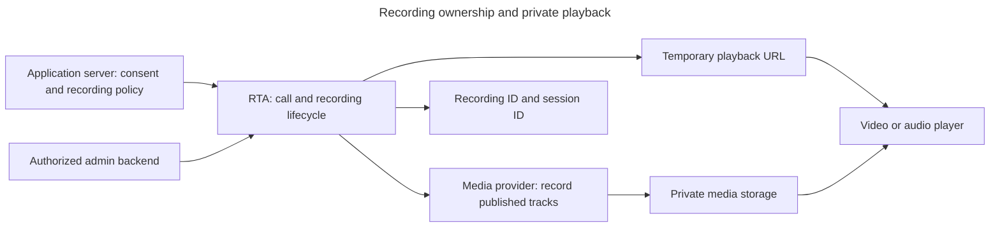

# realtime-avatar

A live character your users can talk to — voice, or voice and video. She listens while she
speaks, so you can interrupt her mid-sentence and she stops, the way a person stops.

```bash
npm install --save-exact realtime-avatar@0.16.0
```

```ts
import { RealtimeAvatar, isQueued } from "realtime-avatar";

const rta = new RealtimeAvatar({ apiKey: process.env.REALTIME_AVATAR_API_KEY! });

// On your server. The client picks WHO to call; you decide everything about the call.
const call = await rta.startCall({
  avatarId: "ava_…",
  instructions: "You are Rin. Short, warm, specific sentences.",
  maxSeconds: 600,
});

if (isQueued(call)) return { queued: true, position: call.position };
return call.raw;   // relay to the browser byte-for-byte
```

That is the whole server half. The client joins with the payload and renders her.

## Optional call recordings

Your server decides whether to record after your application obtains consent:

```ts
const call = await rta.startCall({ avatarId, recording: "audio_video" });
if (!isQueued(call) && call.recording) {
  await saveRecordingId(call.sessionId, call.recording.recordingId);
}

// Later, in your authenticated admin backend:
const recording = await rta.getRecording(recordingId);
if (recording.status === "ready") {
  const { url, expiresAt } = await rta.getRecordingAccess(recordingId);
  // Return this short-lived access to the authorized viewer.
}
```

Omitted or `"off"` disables recording. `"audio"` records published user and avatar audio;
`"video"` records published video without audio; `"audio_video"` keeps both on one media timeline.
Recording does not enable the microphone, camera, or screen sharing. Only tracks that participants
authorize and publish can be recorded. Camera controls remain a future SDK feature.

Recordings may finish processing after a call ends. Use `listRecordings({ sessionId })` to find
them, or refresh `getRecording(recordingId)` while processing. These methods and
`getRecordingAccess` require a server key with `recordings:read`.

Save `recordingId`, not a playback URL. Files are retained until `retainedUntil` (30 days by
default); each URL expires at `expiresAt` (up to one hour, capped by retention). Obtain fresh
access before replaying or seeking after expiry. An expired URL does not delete the file.
Treat the URL as private: anyone who has it can play that file until it expires.

Transcript delivery remains the signed `transcript` webhook configured on `startCall`. Join the
transcript and recordings by `sessionId`; keep your own script revision with that call. Transcript
timestamps describe conversation turns and do not by themselves establish frame-accurate media
alignment for lip-sync analysis.

Client-safe Zod schemas and derived types are available from `realtime-avatar/recording`.
They are the same executable contract used by the service, verified against the published digest.



New here? The [quickstart](https://realtimeavatar.ai/docs/quickstart) goes from an API key to a
working call, and a [sandbox key](https://realtimeavatar.ai/signup) is free with no card. Mount
the server half on your framework:
[Next.js](https://realtimeavatar.ai/docs/nextjs) ·
[Express](https://realtimeavatar.ai/docs/express) ·
[Hono, Workers, Bun, Deno](https://realtimeavatar.ai/docs/hono) ·
[TanStack Start](https://realtimeavatar.ai/docs/tanstack-start), and render it with
[React or React Native](https://realtimeavatar.ai/docs/react).

Using a coding agent? Point it at [`AGENTS.md`](../../AGENTS.md) and give it the
[MCP server](https://realtimeavatar.ai/docs/mcp) so it can read your real avatar ids instead of
inventing them.

---

## What you get

| | |
| --- | --- |
| **Voice or video** | The same call, the same code. `mode: "voice"` is audio-only and cheaper. |
| **Full-duplex** | Interrupt her and she stops. A cough does not derail her. A pause is not the end of your turn. |
| **Your character** | Your footage, your voice, your persona — not a stock presenter. |
| **Your tools** | You run them; you feed the result back into a turn. Nothing calls your API on your behalf. |
| **Priced to leave on** | Under $5/hour of live conversation, billed by the second. |

---

## The shape of an integration

```
your client  ──▶  your backend  ──▶  Realtime Avatar
                  (holds the key,      (capacity, listening,
                   decides the call)    thinking, speaking, rendering)
     ◀────────── live audio + video, and she is listening ──────────
```

Two facts follow from that picture and drive everything else:

1. **The key is server-only.** A browser holding it can start unlimited calls on your
   account. The constructor throws in a browser runtime so that fails loudly, not silently.
2. **The connection payload is opaque.** Relay `call.raw` untouched — the browser client
   validates it strictly.

---

## API

Everything is on one class. The full types are in
[`libs/http-client/src/types.ts`](../http-client/src/types.ts) — one file, no import chasing.
Almost every shape in it is **derived** from the published OpenAPI contract rather than declared
beside it, so a field that changes upstream fails the typecheck here. The exceptions are named at
the top of that file with the reason for each: two are gaps in the contract itself (it declares no
query parameters for `GET /v1/usage/sessions`, and the transcript webhook body is not in it at
all), and the `video` policy types are deliberately not one-to-one with the wire.

```ts
// calls
rta.startCall({ avatarId, mode?, instructions?, context?, maxSeconds?, video?, recording?, transcript?, metadata? })
rta.endCall(sessionId, { reason? })     // free an abandoned call's slot; idempotent, never throws

// optional recordings; server only, requires recordings:read
rta.listRecordings({ sessionId, limit?, cursor? })
rta.getRecording(recordingId)
rta.getRecordingAccess(recordingId)

// avatars
rta.createAvatarFromImage({ displayName, imageUrl, motionPrompt?, voice? })  // the only lane
rta.createAvatarFromVideo({ displayName, videoUrl, voice? })                 // DEPRECATED — closed, 422
rta.listAvatars()
rta.getAvatar(avatarId)
rta.updateAvatar(avatarId, patch)       // re-point displayName / defaultVoiceId
rta.swapSource(avatarId, { sourceAssetId, anchorTimeMs? })  // re-shoot her: new loop, library re-renders
rta.retimeAnchor(avatarId, anchorTimeMs)                    // same loop, different rest frame
rta.deleteAvatar(avatarId)

// clip library — declared as JSON, never as URLs
rta.setClipLibrary(avatarId, { expectedRevision, clips, idle?, on?, actions? })  // full source record + behavior; revision required
rta.setLoop(avatarId, { motionPrompt })     // re-direct the RESTING LOOP; clips untouched
rta.waitForLoop(avatarId)               // block until it settles; THROWS if it failed
rta.waitForClips(avatarId)              // block until nothing is still rendering
rta.listClips(avatarId)                 // rows + revision, anchor, eligibility

// assets
rta.createRemoteAsset({ kind, remoteUrl })
rta.uploadAsset(file, { kind })

// billing
rta.creditBalance()                                 // balance + reserved
rta.listSessions({ from, to, endUserId })           // per-session: when, how long, what it cost
rta.iterateSessions({ from, to })                   // the same, paging handled

// webhooks
verifyTranscript(rawBytes, headers, secret)
```

---

## Subpaths

**One install.** tsup treeshakes per entry, so a server-only app importing `realtime-avatar/server`
gets 18.8 KB with no React and no LiveKit in it, even though they sit in the same tarball.

Server — these hold your API key:

| Import | What it is |
| --- | --- |
| `realtime-avatar` | `RealtimeAvatar`, `isQueued`, `verifyTranscript`, the two error classes |
| `realtime-avatar/server` | The same client with no route adapters — 18.8 KB |
| `realtime-avatar/nextjs` | `createRealtimeAvatarRoute` — App Router `{ GET, POST }` |
| `realtime-avatar/hono` | `realtimeAvatarHono` — Hono, Workers, Bun, Deno |
| `realtime-avatar/express` | `realtimeAvatarExpress` |
| `realtime-avatar/tanstack-start` | TanStack Start server route |

Browser — these never can:

| Import | What it is |
| --- | --- |
| `realtime-avatar/react` | `AvatarCall`, `useAvatarCall`, `useRealtimeSession`, `useSessionLifecycle` |
| `realtime-avatar/react-native` | The same surface for Expo / React Native |
| `realtime-avatar/browser` | `enableMicrophone`, `attachRemoteAudio`, `prepareAvatarRoom` — no React |
| `realtime-avatar/tools` | `attachAvatarTools` — the browser tool plane |
| `realtime-avatar/recording` | Client-safe Zod recording schemas and derived types |

Every adapter takes the same two hooks: `authorize` gates the request, `session` decides the
call. Policy — `instructions`, `maxSeconds`, `voice`, `video` — is decided in `session`, on
your server. A route that spreads the request body into `startCall` hands your caller your
system prompt and your bill.

### Optional connection details

`AvatarCall` provides call status, actions and end reasons for your default UI. To show
connection diagnostics, opt in with `onConnectionDetailsChange`. It supplies data for
your own UI; enabling it adds no built-in network notice or controls.

```tsx
import { useState } from "react";
import { AvatarCall, type AvatarCallProps, type AvatarConnectionDetails } from "realtime-avatar/react";

function CallWithDetails(props: Pick<AvatarCallProps, "client" | "avatarId">) {
  const [details, setDetails] = useState<AvatarConnectionDetails | null>(null);

  return (
    <>
      <AvatarCall {...props} onConnectionDetailsChange={setDetails} />
      {details && <p>Connection: {details.connectionState}. Local quality: {details.localQuality}.</p>}
    </>
  );
}
```

Once bound to a call, the callback receives an initial snapshot, then changed facts only. It receives `null`
when its room or session binding is retired, before a replacement binding's snapshot.
Clearing the session grant keeps details reset until a new grant arrives.
Keep this state scoped to one call and clear it on `null`, as the example does. This is
a current snapshot, not a lossless event history. Replacing the handler does not restart
the call, and errors in your handler do not interrupt it. Omitting the callback adds no
reporting listeners; the callback adds no timers, stats polling or uploads.

Each field preserves LiveKit's native type and meaning:

| Field | Source |
| --- | --- |
| `connectionState` | The bound room's `state`. |
| `localQuality` | The local participant's `connectionQuality`. |
| `audio.publisherQuality` | The selected audio publisher's `connectionQuality`. |
| `video.publisherQuality` | The selected video publisher's `connectionQuality`. |
| `audio.streamState`, `video.streamState` | The corresponding remote track's `streamState`, or `null` before the track exists. |

Audio and video publishers are selected independently and can differ. Neither field
substitutes the control agent or an arbitrary remote participant. `audio` or `video` is
`null` when no corresponding track reference is selected; LiveKit's `Unknown` quality
means a publisher exists but its quality is unknown. An active or subscribed track does
not prove that video has rendered or audio is audible. Continue using call status for
the call lifecycle.

Native and custom integrations pass the same optional callback to their existing
`SessionLifecycleRoomBridge` inside `RealtimeAvatarLiveKitRoom`. Both
`realtime-avatar/react` and `realtime-avatar/react-native` export `AvatarConnectionDetails`.
For deeper receiver measurements, use LiveKit's public `RemoteVideoTrack.getReceiverStats()`
and `RemoteAudioTrack.getReceiverStats()` methods and their native return types.

Retain the app's session-to-room association (`room_name`, timestamps and participant
identity), adding the server-observed room SID when exact room-lifetime lookup needs it.
LiveKit owns participant connection history; a participant SID identifies one incarnation.
Use these references to look up details in LiveKit's own diagnostics. The existing quality governor
and opt-in adaptive playout are product policies over LiveKit facts; setting
`adaptiveQuality={false}` releases the manual quality ceiling while LiveKit's bandwidth
adaptation continues. Adaptive playout reads only public LiveKit track reports.

### Importing a server entry into a browser build throws

Not a lint rule and not a naming convention — the six server subpaths carry `browser` and
`react-native` export conditions pointing at a module whose only statement is a `throw`, so the
key-holding code never enters a client module graph. Measured: a browser bundle that imports both
halves contains **0** occurrences of `Bearer` or `apiKey`.

This lived under a second npm name (`realtime-avatar-react`) until 2026-08-26, on the theory that a
condition "chooses which file is bundled, never whether the package is". That was tested and is
false. Two things worth knowing if you copy the pattern: do **not** use `"browser": null` — Vite 8
and rolldown ignore it and bundle the server file *with* the secret — and do not leave
`"sideEffects": false` in place, which lets a bundler treeshake a throw-only module away and
silently disarms the whole guard.

## The two subpaths that are not React

`enableMicrophone` returns the cause as a value instead of throwing, because "the mic won't
start" is one sentence covering six causes with different fixes — and one of them, a macOS
system denial, cannot be fixed from the address bar and needs the browser restarted.
`attachRemoteAudio` attaches into the DOM *before* `connect`, which is what stops a track
arriving mid-connect from being lost on a fast connection.
`prepareAvatarRoom(room)` — one call after `new Room()` — gives every track the room subscribes
the same 0.5s receiver cushion the React surface applies on its own: the avatar crosses the public
internet, a shallow buffer freezes on every lost packet, and a deeper one recovers it before
playout (measured at ~5% loss: ~11fps with multi-second freezes → a steady 25fps). It covers audio
and video alike so the pair stays lip-locked, and `attachRemoteAudio` calls it for you, so a page
that follows the pattern above never has to know the knob exists. `applyPlayoutDelay(track)` is the
per-track primitive underneath. Until these lived here the cushion was only reachable through
`/react`, which is why every plain-DOM page — this repo's demos included — froze that way; and in
React it was applied only by `AvatarVideoSurface`, so `RealtimeAvatarLiveKitRoom` now applies it
room-wide to whatever you render inside it (`playoutDelaySeconds={false}` opts out).

`attachAvatarTools` runs your functions in the page. Nothing is executed on the platform, and
a tool has **2.5 seconds** to answer before the call gives up on it and tells her it failed.

## What `/react` exports, and what it deliberately does not

31 names, down from 82 on 2026-08-26. Two groups came out and are not coming back:

**LiveKit symbols.** `Room`, `RoomEvent`, `Track`, `useRoomContext` and 20 others were
re-exported from here. `livekit-client` and `@livekit/components-react` are peer dependencies, so
import them from LiveKit directly and you get the version you installed — re-exporting put their
types in this package's public surface, which meant a LiveKit major could break ours without a
line of our code changing.

**State-machine internals.** `acquireMicLease`, `stepQualityGovernor`, `retryStep`,
`resolveWarnBeforeMs` and 27 more were the individual steps the hooks drive. None was callable in
a useful order from outside, and every one was a name we would have had to keep working forever.

What stayed: the components and hooks, the `DEFAULT_*` constants (so you can read the timings
rather than guess them), the two capacity mappers `capacityErrorFromBusy` / `capacityStateFromGrant`
for building your own queue UI, and the zod schemas `sessionBehaviorSchema` / `sessionClipSchema`.


---

## Docs and support

- Full documentation: <https://realtimeavatar.ai/docs>
- [Quickstart](https://realtimeavatar.ai/docs/quickstart) — key to a live call
- [Authentication](https://realtimeavatar.ai/docs/authentication) — what belongs on your server, and why
- [Calls](https://realtimeavatar.ai/docs/sessions) — what your server decides and what the client reports
- [Creating an avatar](https://realtimeavatar.ai/docs/video) — one photo in, a moving character out
- [Tool calling](https://realtimeavatar.ai/docs/tool-calling) — your handlers, your server, no hosted executor
- [MCP server](https://realtimeavatar.ai/docs/mcp) — give a coding agent the account itself
- [API reference](https://realtimeavatar.ai/docs/api-reference) · [OpenAPI 3.1](https://realtimeavatar.ai/openapi.json)
- [Pricing](https://realtimeavatar.ai/pricing) — one meter, seconds on air
- Issues and feature requests: this repo
- The API is versioned at `/api/v1`; breaking changes get a new version, not a silent edit.

MIT licensed.
